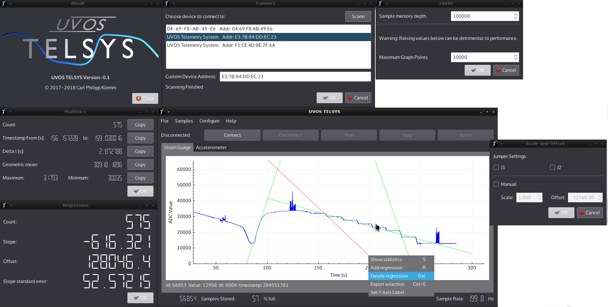

# TelsysMaster

Telsys master is a GUI client for the Telsys mesurement device. It allows you to recive adc/wheatstone bridge samples and acceleration samples from the device and display them. It also provides data analysis and conversion tools. It runs on Linux with an android port working in beta state.

Requirments To build:

* QT5.14 with QBluetooth support built
* GCC
* gnu make
* A Linux host system

Procedure to build and install this applicaiton

1. clone with 'git clone https://github.com/IMbackK/TelsysMaster.git'
2. enter the directory created in a unix shell
3. run 'qmake .'
4. run 'make'
5. run 'make install' as super user

Open source hardware plans for the hardware used with this client can be found here:
https://github.com/IMbackK/TelsysHW

The firmware this client communicates with can be found here:
https://github.com/IMbackK/TelsysFW

